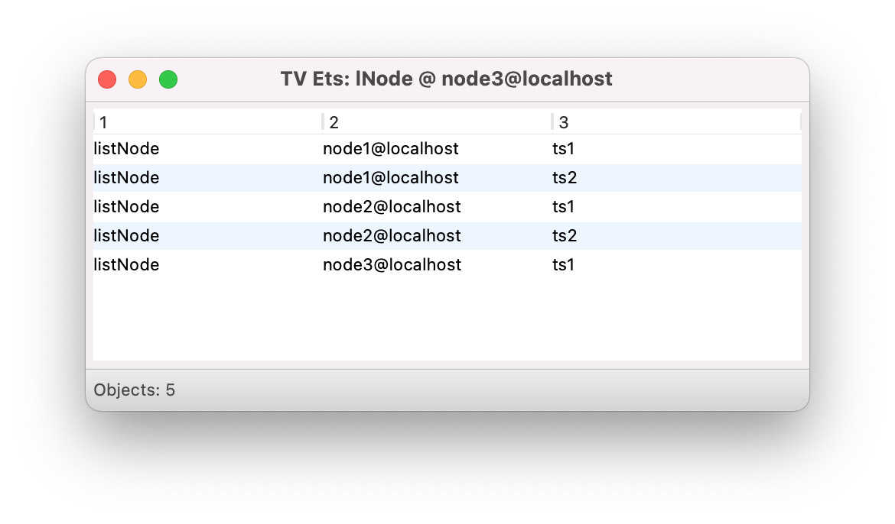

# ADCC - Progetto A.A. 2021/2022 
## Implementazione di uno spazio di tuple in Erlang

Progetto di Applicazioni Distribuite e Cloud Computing 

## Applicazioni distribuite e Cloud Computing

Autore 
## Paolo Capellacci


## Descrizione
Questo progetto consiste nell'implementare uno spazio di tuple in linguaggio Erlang

L'implementazione dell'algoritmo si deve soddisfare le seguenti specifiche.
- Gestione dei nodi
- Gestione delle Tuple
- Gestire il sincronismo telle tuple tra i nodi
- Modalita di ricerca con Time Out
- Pattern Macching
- Test


## Premessa
Erlang permette di avviare un processo su una macchina in rete e tale processo si identifica come nodo e tale nodo può comunicare con altri nodi dello stesso computer, ma anche con nodi su altri computer e / o reti diverse. Quindi una volta definito un nome al processo, Erlang provvederà a identificarlo all'interno del computer ed in rete.  

## Gestione dei nodi.
Il progetto prevedere l'uso della console da cui vi avvia un processo dandogli un nome, ogni istanza sarà un nodo con un nome univoco del tipo `nome_nodo@nome_computer`.
A seguito è necessario implementare le seguenti funzioni al fine che soddisfino le specifiche del progetto.
- `addNode(TS, Node)`
Implementazione tramite la funzione `node:addNode(TS, Node)`. dove prende i nome del `TS` ed il nome del nodo che verrà inserito nell'ets `lNode`. 
- `removeNode(TS node)`
Implementazione tramite la funzione `node:removeNode(TS, Node)` anche in questo caso la corrispondenza va ad eliminare la ricorrenza sull'ets `lNode`
- `node(TS)`
Implementazione tramite `node:nodes(TS)` che a seguito di un filtro `ets:select(lNode, [{{'$1','$2', '$3'},[{'=:=','$3',TS}],['$2']}])` preleva tutti i nodi che hanno quella ricorrena
- per funzionare correttamente è necessario implementare una serie di funzioni che risolvono le problematiche di singronizzazione 
##### `Gestire il sincronismo telle tuple tra i nodi)`

## Gestione delle Tuple
In questo caso il progetto deve provvedere:
- ### new(name)
La funzione `esame:new(Name)` prende un nome ed istanzia un novo `TS` ed istanzia un ets con `ets:new(TS, [named_table, bag, public])`, nel caso esiste già un controlo evita la creazione.

- ### out(TS, Tuple)
La funzione `esame:out(TS, Tuple)` prende il nome del `TS` e la `Tupla` da inserire ,controlla se il `TS` esiste e fa l'inserimento, se l'inserimento ha esito positivo invoca la funzione per aggiornare la tupla anche sugli altri nodi che hanno visibilità

- ### rd(TS, Pattern)
La funzione `esame:rd(TS, Pattern)` prende il nome del `TS` ed il `Pattern` da conforontare, dato che è più semplice confrontare una lista, le singole tuple vengono trasformate in liste e passate alla funzione `db:match(Tupla, Pattern)`.
Se ha esito positivo torna una lista delle tuple trovate, questa funzione non fa nessun aggiornamento sui nodi dato che non cammbia lo stato della memoria dei `TS`.

- ### in(TS, Pattern)
La funzione `esame:in(TS, Pattern)` prende il nome del `TS` ed il `Pattern` confronta se esiste una corrispondenza come fa `esame:rd(TS, PAttern)` ma nel caso che trova la corrispondenza invoca la funzione `ets:match_delete(TS, Value)` per provverere alla eliminazione della tupla, anche in questo caso viene invocata la funzione per suncronizzare i nodi che hanno quel `TS` per provvedere all'eliminazione nei `TS` degli altri nodi.

## Modalita di ricerca con Time Out
- ### rd(TS, Pattern, TimeOut) 
Questa funzione `esame:rd(TS, Pattern, TimeOut)` è simile alla `rd/2` tranne per il fatto che gli viene passato un valore aggiuntivo come argomento che continua a provare per un tempo `TimeOut` il pattern macching.

- ### in(TS, PAttern TimeOut) 
Anche questa funzione `esame:in(TS, Pattern, TimeOut)` ha comportamento analogo della precedente tranne per il fatto che provvedea alla cancellazione della tupla ed a sincronnizare i nodi che hanno la visibilità anche per quel `TS`.

## Pattern Macching
Il pattern Macching deve presedere il carattere jolly identificato con l'atomo any
Example: `match([any,3,”pippo”], [1,3,”pippo”]) = true`
```
PatternList = tuple_to_list(Pattern),
ValueList = tuple_to_list(Value),
```  
qundi si passano i due array alla funzione `match(PatternList, ValueList)`

```
match([], []) ->
    true;

% controlla la lunghezza dell'array  
match(_A, []) ->
    false;

match([], _B) ->
    false;

match([HP | TP], [HL | TL]) ->

    case HP of
        any -> 
            match(TP, TL);
        HL ->
            match(TP, TL);
        _ ->
            false
    end
.
```


## Gestire il sincronismo telle tuple tra i nodi
Iniziamo con il dire che per tenere traccia delle regole di visibilità dei TS in corrispondenza dei nodi si è dedicato un ets `lNode` che tiene traccia dei TS e nodi aggiunti dalla funzione `node:addNode(TS, Node)`
La struttura dell'ets `lNode` è la seguente ed ha le seguente dicliarazione, `ets:new(lNode, [named_table, bag, public, {keypos,#listNode.node}])`.
``` 
-record(listNode, {
    node,
    ts
}).
```



Per rincronizzare i nodi raggiungibili o meno che nell'ets `lNode` hanno una corrispondenza sono necessarie le seguenti funzioni

- `<node:nodes(TS)>` prende il nome di un TS e restituisce la lista di nodi che hanno corrispondenza nell'`lNode`, usando `ets:select(lNode, [{{'$1','$2', '$3'},[{'=:=','$3',TS}],['$2']}])` al fine di avere  `[listNode, node1@localhost, ts1]`.

- `node:listNodes()` non pende nessun argomento e restutuisce tutti i nodi che sono presenti nell'ets `lNode`, usando `ets:select(lNode,[{{'_','$2','_'},[],['$2']}])`

- `esame:getListTuples(Node)` prende come argomento un nodo e restituisce la lista dei `TS` per quel nodo, usando `ets:select(lNode, [{{'$1','$2','$3'},[{'=:=','$2',Node}],['$3']}])`

Per far si che tutti i nodi abbiano un aggiornamento delle tuple a cui hanno visibilità si è aggiunto la lunzione `node:ceckAll()` che utilizzando la funzione `node:listNode()`, ha a disposizione tutti i nodi che hanno motivo di essare contattati, e con la funzione `esame:getListTuple(Node)` torna la lista dei `TS` che serve inviare o aggiornare.

In seguito la funzione `node:updateTsNode(TS, Node)` aggiorna il nodo con il solo `TS` che vengono passati come argomento, utile da richiamare all'aggiunta di un nuovo nodo e/o un nuovo `TS`,

Nel caso di un novo `TS` non è necessario contattare tutti i nodi e riaggiornare tutti i `TS`, quindi ho provveduto a aggiungere la funzione `node:ceckAllNode(TS)` che passando il `TS` come argomneto contatta i soli nodi che hanno visibilità per quel `TS` e li aggiorna.

In caso di cancellazione di una tupla su un `TS` è stata aggiunta la funzione `ceckDeleteDataTS(TS, Tupla)` che prendendo il `TS` e la `Tupla` controlla chi ha visibilità per quel `TS` ed invoca la funzione `memactor ! {out, TS, Dump, self()},` per cancellare la tupla in quel `TS`, avendo l'informazione della visibilità tale funzione viene rilanciata anche nel caso il `TS` è presente su più nodi.


## Test
Al fine di eseguire i test è necessari condiderare che è necessario avviare erlang definendo il nome del nodo con `erl -snode node1@localhost`.
Una volta avviati i nodi necessari al test è necessario avviare la compilazione dei file erlang ed avviare il processo.

#### init
```
c(esame).
c(db).
c(node).
db:initdb().

```


a seguito si possono inserire i vari `TS` e popolarli con una funzione dedicata

```
esame:new(ts1)          % aggiunge un Tuple Space con nome ts1
esame:new(ts2)          % aggiunge un Tuple Space con nome ts2
esame:populate(ts1)     % popola il Tuple Space ts1 con tuple numeriche 
esame:populate(ts2)     % popola il Tuple Space ts1 con tuple numeriche 

```


aggiungendo le visibilità dei TS ai nodi
```
node:addNode(ts1, node1@localhost).
node:addNode(ts1, node1@localhost).
node:addNode(ts1, node2@localhost).
node:addNode(ts1, node2@localhost).
node:addNode(ts1, node3@localhost).
```


#### new(TS)
con la funzione `esame:new(ts1)` aggiunge un nuovo `TS` vuoto.


con la funzione `esame:populate(ts1)` si popola il `TS` con dati interi in parte random.


#### lookup(TS)
con la funzione `esame:look_up(ts1)` si ha l'output nel terminale dell'elenco delle tuple nel `TS` `ts1`.


#### rd(TS, Pattern)
esame:rd(ts1, {5}).


esame:rd(ts1, {93, any, any}).


esame:rd(ts1, {93, any, 54}).


#### in(TS, Pattern)
esame_in(ts1, {16, any, any}).


